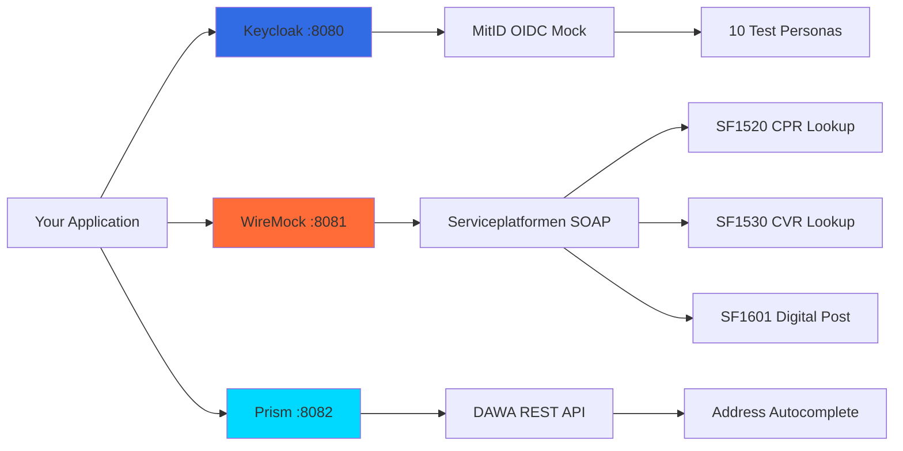

# Danish Government Mock Services

**Platform-agnostic mock services for Danish government integrations**

Test MitID authentication, Serviceplatformen (CPR/CVR/Digital Post), and DAWA address lookups locally without credentials or external dependencies.

## Status

**Version**: 1.0.0
**Status**: Production Ready
**Last Updated**: February 2026

This repository provides realistic mock services for Danish government integrations, enabling local development and CI/CD testing without requiring actual government credentials or network access.

## Architecture Overview



## Quick Start

### Prerequisites

- Docker and Docker Compose installed
- Ports 8080, 8081, 8082 available (configurable)

### Installation

```bash
# Clone repository
git clone https://github.com/YOUR_USERNAME/danish-gov-mocks.git
cd danish-gov-mocks

# Copy environment file
cp .env.example .env

# Start all services
docker compose up -d

# Or start only specific services
docker compose up -d keycloak wiremock
```

### Verify Services

```bash
# Check Keycloak is ready
curl http://localhost:8080/health/ready

# Check WireMock is ready
curl http://localhost:8081/__admin/health

# Access admin consoles
# Keycloak: http://localhost:8080/admin (admin/admin)
# WireMock: http://localhost:8081/__admin
```

## Services Included

### Keycloak (MitID OIDC Mock) - Port 8080

Mock implementation of MitID (Danish national login system) using OpenID Connect.

**Features:**
- 10 realistic Danish test personas with valid CPR numbers
- Both personal (MitID Privat) and business (MitID Erhverv) users
- CPR, CVR, and birthdate claims in tokens
- Pre-configured OIDC client for immediate use

**Endpoints:**
- Admin Console: `http://localhost:8080/admin`
- OIDC Discovery: `http://localhost:8080/realms/danish-gov-test/.well-known/openid-configuration`
- Authorization: `http://localhost:8080/realms/danish-gov-test/protocol/openid-connect/auth`
- Token: `http://localhost:8080/realms/danish-gov-test/protocol/openid-connect/token`

**Test Users:** All passwords are `test1234`

| Username | CPR | Type | Use Case |
|----------|-----|------|----------|
| freja.nielsen | 0804951236 | Personal | Standard citizen |
| lars.andersen | 1505851234 | Personal | Senior citizen |
| mette.jensen | 2003901237 | Business | Business owner |

See [docs/test-data.md](docs/test-data.md) for complete list.

### WireMock (Serviceplatformen SOAP Mock) - Port 8081

Mock implementation of Danish Serviceplatformen services.

**Services Mocked:**
- **SF1520**: CPR person lookup (10 test persons)
- **SF1530**: CVR company lookup (5 test companies)
- **SF1601**: Digital Post (3 scenarios: success, not found, too large)

**Endpoints:**
- Admin UI: `http://localhost:8081/__admin`
- SOAP Endpoint: `http://localhost:8081/soap/sf1520` (and sf1530, sf1601)

**Example Request:**
```bash
curl -X POST http://localhost:8081/soap/sf1520 \
  -H "Content-Type: text/xml" \
  -d @examples/sf1520-request.xml
```

### Prism (DAWA Address Mock) - Port 8082

Mock implementation of DAWA (Danish Address Web API).

**Status**: Coming in v1.1 (OpenAPI spec in progress)

**Usage:**
```bash
# Start with Prism enabled
docker compose --profile full up -d
```

## Integration Guides

Choose your framework:

- [Drupal](docs/integration-guides/drupal.md) - OpenID Connect and SOAP client setup
- [Laravel](docs/integration-guides/laravel.md) - Socialite and SOAP configuration
- [Node.js](docs/integration-guides/nodejs.md) - Passport.js and example Express app
- [Generic HTTP](docs/integration-guides/generic.md) - Raw curl examples and OIDC flow

## CI/CD Usage

### GitHub Actions

```yaml
services:
  keycloak:
    image: quay.io/keycloak/keycloak:23.0
    env:
      KEYCLOAK_ADMIN: admin
      KEYCLOAK_ADMIN_PASSWORD: admin
      KC_HTTP_ENABLED: true
    ports:
      - 8080:8080
    volumes:
      - ./keycloak/realms:/opt/keycloak/data/import
    options: >-
      --health-cmd "curl -f http://localhost:8080/health/ready"
      --health-interval 30s
```

See [ci/github-actions/](ci/github-actions/) for complete templates.

### GitLab CI

```yaml
services:
  - name: quay.io/keycloak/keycloak:23.0
    alias: keycloak
  - name: wiremock/wiremock:3.3.1
    alias: wiremock

variables:
  KEYCLOAK_URL: http://keycloak:8080
  WIREMOCK_URL: http://wiremock:8080
```

See [ci/gitlab-ci/](ci/gitlab-ci/) for complete templates.

## Documentation

- [Architecture Overview](docs/architecture.md) - System design and component interactions
- [Test Data Reference](docs/test-data.md) - Complete persona list with CPR/CVR numbers
- [Troubleshooting](docs/troubleshooting.md) - Common issues and solutions
- [Terminology Glossary](docs/glossary.md) - Danish government service terms

## Configuration

All configuration is done via environment variables in `.env`:

```bash
# Change default ports
KEYCLOAK_PORT=9080
WIREMOCK_PORT=9081
PRISM_PORT=9082

# Change admin credentials
KEYCLOAK_ADMIN=myadmin
KEYCLOAK_ADMIN_PASSWORD=securepassword
```

## Examples

The `examples/` directory contains ready-to-use integration examples:

- `examples/drupal/` - Drupal settings.php configuration
- `examples/laravel/` - Laravel service provider
- `examples/nodejs/` - Express.js application

## Standards Compliance

This project implements the following standards:

- **OpenID Connect 1.0** - MitID authentication mock
- **OAuth 2.0** - Token-based authorization
- **SOAP 1.1/1.2** - Serviceplatformen web services
- **OIO XML Standards** - Danish government XML schemas
- **OpenAPI 3.0** - DAWA REST API specification

## Terminology / Terminologi

| Term | Danish | Description |
|------|--------|-------------|
| CPR | Personnummer | Civil registration number (social security number) |
| CVR | Virksomhedsnummer | Central Business Register number |
| MitID | MitID | Danish national login system (replaced NemID in 2021) |
| Serviceplatformen | Serviceplatformen | Government service integration platform |
| DAWA | Danmarks Adressers Web API | Danish address database API |
| SF1520 | - | Serviceplatformen CPR lookup service |
| SF1530 | - | Serviceplatformen CVR lookup service |
| SF1601 | - | Serviceplatformen Digital Post service |
| NSIS | Fællesoffentlig Digital Infrastruktur | Danish government digital infrastructure standards |

## Contributing

Contributions are welcome! Please see [CONTRIBUTING.md](CONTRIBUTING.md) for guidelines.

## License

Apache License 2.0 - See [LICENSE](LICENSE) for details.

This permissive license allows you to use, modify, and distribute this software for any purpose, including commercial use.

## Related Projects

- [OS2Adgang](https://github.com/OS2sandbox/os2adgang-planning) - Production-ready Danish IdP/SSO solution
- [Keycloak](https://www.keycloak.org/) - Open source identity and access management
- [WireMock](https://wiremock.org/) - API mocking framework
- [Prism](https://stoplight.io/open-source/prism) - OpenAPI mock server

## Support

- **Issues**: https://github.com/YOUR_USERNAME/danish-gov-mocks/issues
- **Discussions**: https://github.com/YOUR_USERNAME/danish-gov-mocks/discussions

## Acknowledgments

Created for the Danish developer community to simplify testing of government service integrations.

Special thanks to the OS2 community for their work on open standards in Danish public sector software.
