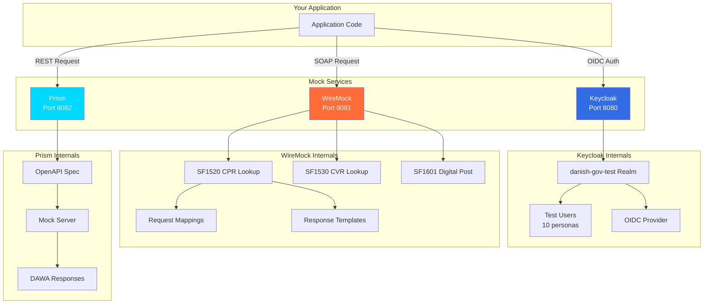
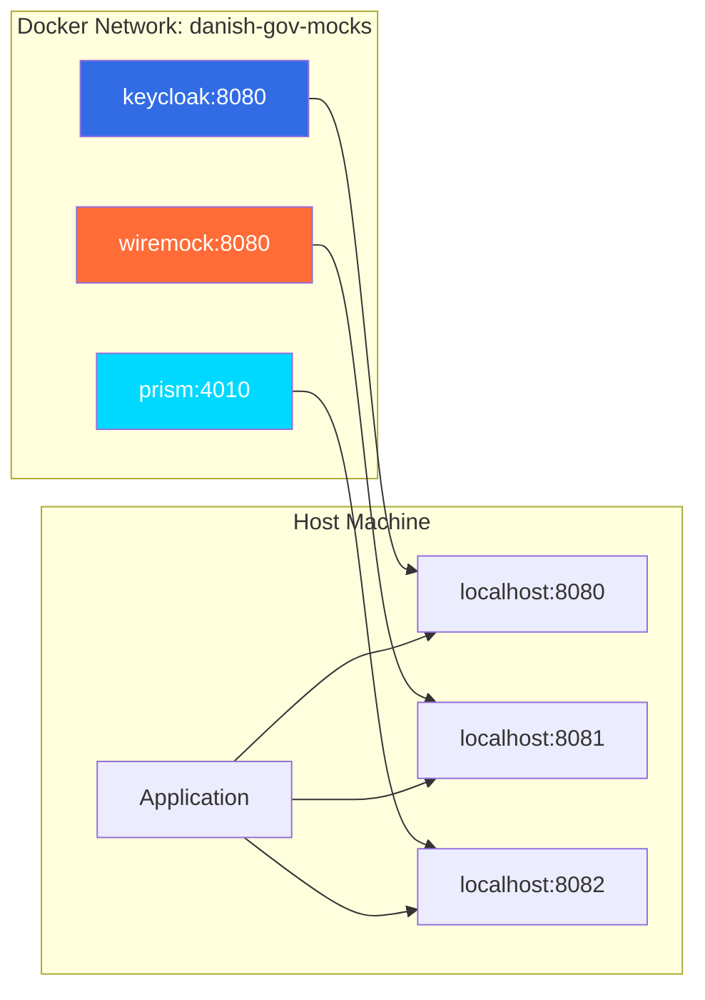

# Architecture Overview

This document describes the technical architecture of the Danish Government Mock Services.

## System Design

The mock services are designed as three independent, containerized services that replicate the behavior of Danish government APIs without requiring actual credentials or network access to government systems.

## Component Architecture



## Service Components

### 1. Keycloak (MitID Mock)

**Purpose**: Mock the MitID authentication system using OpenID Connect.

**Technology**: Keycloak 23.0 (Red Hat's open source identity and access management solution)

**Key Features**:
- Pre-configured realm: `danish-gov-test`
- 10 test personas with realistic Danish data
- Custom protocol mappers for CPR, CVR, and birthdate claims
- Standard OIDC endpoints (authorization, token, userinfo)

**Data Flow**:
1. Application redirects user to Keycloak login
2. User authenticates with test credentials
3. Keycloak issues authorization code
4. Application exchanges code for access token
5. Token contains Danish-specific claims (CPR, CVR)

**Configuration**:
- Realm imported from `keycloak/realms/danish-gov-test.json`
- Pre-configured client ID: `aabenforms-backend`
- Client secret: `aabenforms-backend-secret-change-in-production`

### 2. WireMock (Serviceplatformen Mock)

**Purpose**: Mock SOAP-based services from Serviceplatformen (Danish government service integration platform).

**Technology**: WireMock 3.3.1 (HTTP mock server with request matching and response templating)

**Services Implemented**:

#### SF1520 - CPR Person Lookup
- Queries person data by CPR number
- Returns OIO XML responses with person details
- 10 pre-configured test persons

#### SF1530 - CVR Company Lookup
- Queries company data by CVR number
- Returns CVR register information
- 5 pre-configured test companies

#### SF1601 - Digital Post
- Simulates sending official digital mail
- Three scenarios: success, recipient not found, message too large

**Data Flow**:
1. Application sends SOAP request to WireMock endpoint
2. WireMock matches request against stub mappings
3. Returns pre-configured XML response from `__files/`
4. Supports response templating for dynamic content

**Configuration**:
- Request mappings: `wiremock/mappings/`
- Response templates: `wiremock/__files/`
- Global response templating enabled for dynamic values

### 3. Prism (DAWA Mock)

**Purpose**: Mock the DAWA (Danmarks Adressers Web API) for address autocomplete and validation.

**Technology**: Stoplight Prism 4 (OpenAPI-driven mock server)

**Status**: Planned for v1.1 (OpenAPI specification in development)

**Planned Features**:
- Address autocomplete
- Address validation
- Geocoding (address to coordinates)
- Reverse geocoding (coordinates to address)

## Network Architecture



**Port Mappings**:
- Keycloak: Host 8080 → Container 8080
- WireMock: Host 8081 → Container 8080
- Prism: Host 8082 → Container 4010

**Network Isolation**:
All services run on a dedicated bridge network (`danish-gov-mocks`), isolated from other Docker networks unless explicitly configured.

## Standards Compliance

### OpenID Connect (Keycloak)

Implements the following OIDC specifications:
- **Authorization Code Flow** (RFC 6749)
- **ID Token** (OpenID Connect Core 1.0)
- **UserInfo Endpoint** (OpenID Connect Core 1.0)
- **Discovery** (OpenID Connect Discovery 1.0)

### SOAP (WireMock)

Implements the following SOAP standards:
- **SOAP 1.1 / 1.2** (W3C)
- **OIO XML Standards** (Danish government XML schemas)
- **WS-Security** (headers supported but not enforced in mock)

### REST (Prism)

Implements the following REST standards:
- **OpenAPI 3.0** specification
- **JSON responses** with proper content types
- **HTTP status codes** following REST conventions

## Security Considerations

### This is a MOCK - Not for Production

These services are designed for development and testing only:

- No actual encryption of sensitive data
- Simplified authentication (no MFA, no real CPR validation)
- All credentials are publicly known
- No rate limiting or abuse protection
- No audit logging

### Safe Usage

**DO use for**:
- Local development
- CI/CD pipelines
- Integration testing
- Proof of concepts

**DO NOT use for**:
- Production environments
- Real citizen data
- Public-facing services
- Compliance testing (use actual government test environments)

## Performance Characteristics

### Resource Usage

Typical resource consumption on a development machine:

- **Keycloak**: 500MB RAM, <1% CPU (idle)
- **WireMock**: 100MB RAM, <1% CPU (idle)
- **Prism**: 50MB RAM, <1% CPU (idle)

### Startup Times

- **Keycloak**: 30-60 seconds (realm import on first start)
- **WireMock**: 5-10 seconds
- **Prism**: 2-5 seconds

### Response Times

- **Keycloak OIDC**: <100ms (token endpoint)
- **WireMock SOAP**: <50ms (stub responses)
- **Prism REST**: <20ms (mock responses)

## Extensibility

### Adding New Test Users

Edit `keycloak/realms/danish-gov-test.json`:

```json
{
  "username": "new.user",
  "enabled": true,
  "credentials": [
    {
      "type": "password",
      "value": "test1234"
    }
  ],
  "attributes": {
    "cpr": ["1234567890"],
    "birthdate": ["1967-12-12"]
  }
}
```

Restart Keycloak to import changes.

### Adding New SOAP Stubs

Create a new mapping file in `wiremock/mappings/sf1520/`:

```json
{
  "request": {
    "method": "POST",
    "urlPathPattern": "/soap/sf1520",
    "bodyPatterns": [
      {
        "matchesXPath": "//cpr[text()='1234567890']"
      }
    ]
  },
  "response": {
    "status": 200,
    "bodyFileName": "sf1520/new-person.xml",
    "headers": {
      "Content-Type": "text/xml"
    }
  }
}
```

Create corresponding XML in `wiremock/__files/sf1520/new-person.xml`.

## Troubleshooting

See [troubleshooting.md](troubleshooting.md) for common issues and solutions.

## References

- [Keycloak Documentation](https://www.keycloak.org/documentation)
- [WireMock Documentation](https://wiremock.org/docs/)
- [Prism Documentation](https://docs.stoplight.io/docs/prism)
- [OpenID Connect Specification](https://openid.net/connect/)
- [Serviceplatformen Documentation](https://digitaliseringskataloget.dk/integration/sf1500)
